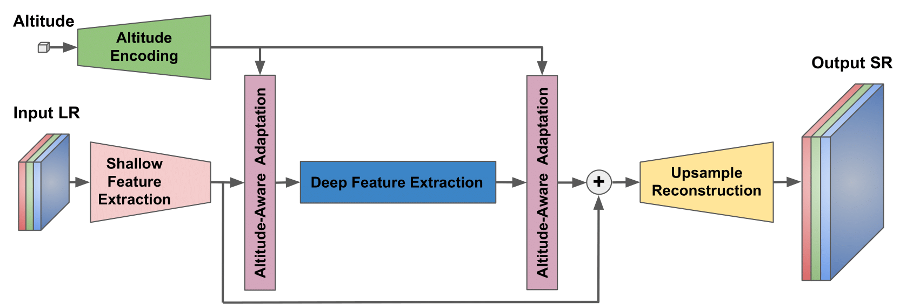

# DSR: Towards Drone Image Super-Resolution
 


*Under submission*

#### [[Paper]](https://github.com/IVRL/DSR) - [[Supplementary]](https://github.com/IVRL/DSR) - [[Dataset]](https://github.com/IVRL/DronePrivate/DroneSR-X7)

> **Abstract:**
*Despite achieving remarkable progress in recent years, single-image super-resolution methods are developed with artificial limitations.
Specifically, they are trained on fixed content domains with certain degradations (whether synthetic or real).
The priors they learn are prone to overfitting the training configuration.
Therefore, the generalization to novel domains such as drone top view data, and across altitudes, is currently unknown.
Nonetheless, pairing drones with proper image super-resolution is of great value.
It would enable drones to fly higher covering larger fields of view, while maintaining a high image quality.*
<br>*To answer these questions and pave the way towards drone image super-resolution, we explore this application with particular focus on the single-image case.
We propose a novel drone image dataset, with scenes captured at low and high resolutions, and across a span of altitudes. 
Our results show that off-the-shelf state-of-the-art networks perform worse on this different domain. 
We additionally show that simple fine-tuning, and incorporating altitude awareness into the network's architecture, both improve the reconstruction performance.*

## Table of Contents
- [Requirements](#requirements)
- [DSR Dataset](#dsr-dataset)
- [Model training and testing](#model-training-and-testing)
- [Citation](#citation)
- [Acknowledgements](#acknowledgements)

## Requirements
- Python 3.8, PyTorch 1.7.1;
- Other common packages listed in [`environment.yml`](environment.yml).

## DSR Dataset

We create our DSR dataset by capturing image pairs of the same scene with different focal length values. 
We take photos at ten different altitudes for each scene. 
Our altitude values form the set \{10, 20, 30, 40, 50, 70, 80, 100, 120, 140\}$m$, 
which is chosen in such a way as to have good sampling across altitudes, 
various altitudes that are multiples of each other, 
and to span a large range of altitudes that are relevant for drone applications.

<p align="center">
  
</p>


The dataset is split into three sets for training, validation, and testing, 
while ensuring that no overlaps exist between any of the sets. 
The split information is saved in  [`train_valid_test_split.json`](datasets/DSR/train_valid_test_split.json)

**The implementation of data preprocessing and registration is provided [here](https://github.com/IVRL/DronePrivate/tree/main/DroneSR-X7).**

## Model training and testing
We benchmark state-of-the-art methods on DSR. 
We evaluate the performance on each altitude to explore its effect. 
To look for potential domain gaps, and to give reference results, we also benchmark on commonly used public datasets. 
And, for consistent comparisons, all datasets are fixed to the same scale factor. 
We then evaluate fine-tuning and our proposed altitude-aware solutions.

### Pretrained off-the-shelf SR methods
We use bicubic interpolation and eight state-of-the-art SR networks for benchmarking results: 
[EDSR](https://github.com/Coloquinte/torchSR), 
[RDN](https://github.com/Coloquinte/torchSR), 
[RCAN](https://github.com/Coloquinte/torchSR), 
[ESRGAN](https://github.com/xinntao/ESRGAN), 
[SwinIR](https://github.com/JingyunLiang/SwinIR), 
[BSRNet](https://github.com/cszn/BSRGAN), 
[NLSN](https://github.com/HarukiYqM/Non-Local-Sparse-Attention) and 
[DASR](https://github.com/The-Learning-And-Vision-Atelier-LAVA/DASR).
We exclusively use the trained networks provided by the corresponding authors with the scale factor of 4. 

We first benchmark on five commonly used public datasets: Div2K, Set5, Set14, B100, and Urban100. 
The LR images are generated with MATLAB's bicubic downsampling with DSR's scale factor (i.e. $\times50/9$).
The sctrip to downsample images is provided in [`bicubic_downsample.m`](src/matlab/bicubic_downsample.m).
We evaluate the performance of SR solutions using PSNR and SSIM on the Y channel in the transformed YCbCr space.

`python -m src.train --arch edsr --scale 50/9 --validation-only --download-pretrained --dataset-val div2k_bicubic --patch-size-val 1000 --eval-luminance --post-resize`

*To bechmark on different model architectures and datasets, change the values of '--arch' and '--dataset-val' respectively.*

With the same setup, we benchmark the aforementioned SR methods on our DSR test set.
To quantitatively explore the effects of altitude, we evaluate separately on each altitude.

`python -m src.train --arch edsr --scale 50/9 --validation-only --download-pretrained --dataset-val dronesr_jpg --val-altitudes 10 --patch-size-val 1000 --eval-luminance --post-resize`

*To bechmark on different altitudes, change the values of '--val-altitudes', which takes values in \{10, 20, 30, 40, 50, 70, 80, 100, 120, 140\}.*

### Fine-tuned SR methods

We fine-tune the SwinIR network on DSR as it achieves the best performance on the public datasets.

- To pretraind SwinIR fitting with our scale factor: 
`python -m src.train --arch swinir_real --scale 50/9 --workers 16 --batch-size 16 --report-to-mlflow --patch-size-val 500 --patch-size-train 300 --batch-size-train 16 --dataset-train div2k_bicubic --dataset-val div2k_bicubic --lr 1e-4 --lr-decay-step 200 --epochs 1000 --adam_betas 0.9 0.99`
- To fineturn SwinIR on DSR:
`python -m src.train --arch swinir_real --scale 50/9 --workers 16 --batch-size 16 --report-to-mlflow --load-from-mlflow TODO --patch-size-val 500 --patch-size-train 300 --batch-size-train 16 --dataset-train dronesr_jpg --dataset-val dronesr_jpg --lr 1e-5 --lr-decay-step 200 --epochs 1000 --adam_betas 0.9 0.99`
*Please fill in '--load-from-mlflow' argument with the mlflow id for pretraining.
To fine-tune on different altitudes, fill in the value of '--train-altitudes'. argument*

### Altitude-aware SR
Inspired by internal feature manipulation techniques and DASR, we use a degradation-aware convolutional block (DAB) for altitude awareness.
In our altitude-aware SwinIR (AA-SwinIR), the shallow and deep image features of SwinIR, along with the encoded altitude information, act as an input for DABs. 
We use two FC layers to encode the altitude. 
The detailed architecture of our AA-SwinIR is shown in the figure below.

<p align="center">
  
</p>

- To pretraind AA-SwinIR fitting with our scale factor: 
`python -m src.train --arch swinir_real_altitude --scale 50/9 --workers 16 --batch-size 16 --report-to-mlflow --patch-size-val 500 --patch-size-train 300 --batch-size-train 16 --dataset-train div2k_bicubic --dataset-val div2k_bicubic --lr 1e-4 --lr-decay-steps 500 800 900 950 --epochs 1000 --adam_betas 0.9 0.99`
- To fineturn AA-SwinIR on DSR:
`python -m src.train --arch swinir_real_altitude --scale 50/9 --workers 16 --batch-size 16 --report-to-mlflow --load-from-mlflow TODO --patch-size-val 500 --patch-size-train 300 --batch-size-train 16 --dataset-train dronesr_jpg --dataset-val dronesr_jpg --lr 1e-5 --lr-decay-step 40 --epochs 200 --adam_betas 0.9 0.99`


## Citation
```bibtex
```

## Acknowledgements

This code is built on [torchSR](https://github.com/Coloquinte/torchSR). 
We thank the authors for sharing their codes.

# DSR
(Under submission) Towards Drone Image Super-Resolution
